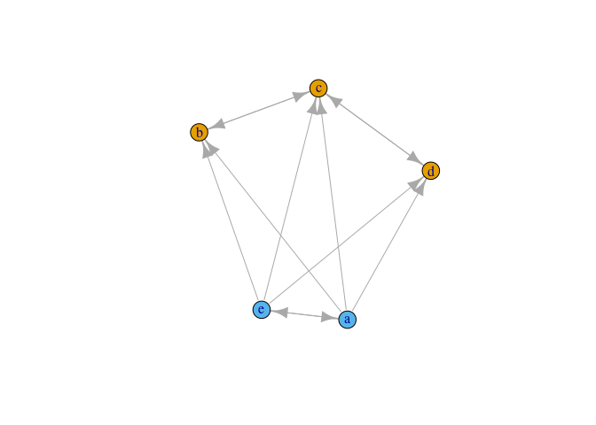
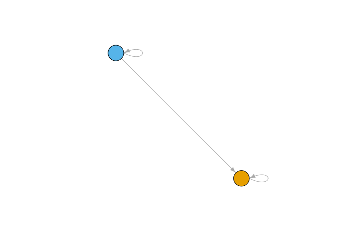
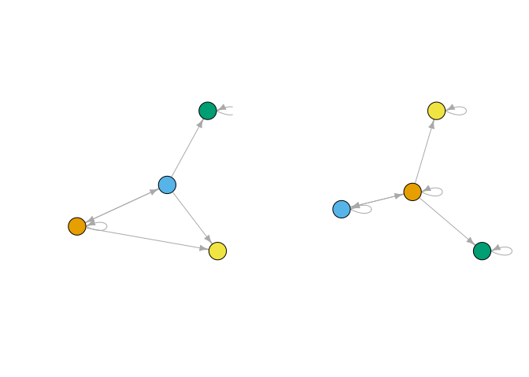
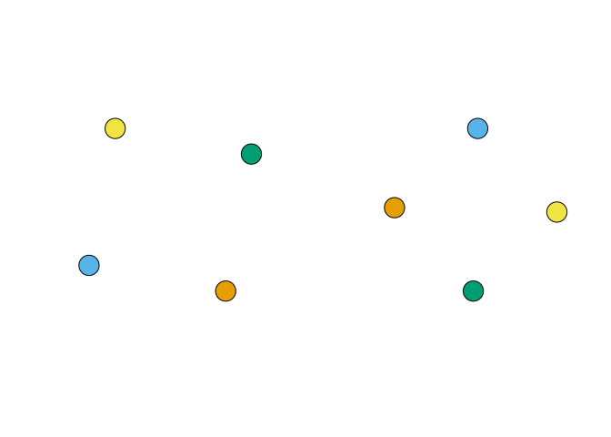

<!-- README.md is generated from README.Rmd. Please edit README.Rmd -->

## Update to `concorR`

I’m updating `concorR` to generate a method for making reduced networks
that connects blocks based on *degree* rather than just *density*.
Functions that are being updated are:

  - `make_blk` in the `CONCOR_blockmodeling.R` file.
  - `make_reduced` in the `CONCOR_blockmodeling.R` file.

<!-- end list -->

``` r
# install.packages("devtools")
devtools::install_github("sfwolfphys/concorR")
```

## Example

This is a basic example which shows a common task: using CONCOR to
partition a single adjacency matrix.

``` r
## Load the package
library(concorR)

## Update to local versions of the important functions:
source('./R/CONCOR_blockmodeling.R')

## Simple Example
a <- matrix(c(0, 0, 0, 0, 1, 1, 0, 1, 0, 1, 1, 1, 0, 1, 1, 
               1, 0, 1, 0, 1, 1, 0, 0, 0, 0), ncol = 5)
rownames(a) <- letters[1:5]
colnames(a) <- letters[1:5]
concor(list(a))
#>   block vertex
#> 1     1      b
#> 2     1      c
#> 3     1      d
#> 4     2      a
#> 5     2      e
```

Additional helper functions are included for using the `igraph` package:

``` r
library(igraph)
#> 
#> Attaching package: 'igraph'
#> The following objects are masked from 'package:stats':
#> 
#>     decompose, spectrum
#> The following object is masked from 'package:base':
#> 
#>     union

plot(graph_from_adjacency_matrix(a))
```


``` r
glist <- concor_make_igraph(list(a))

plot(glist[[1]], vertex.color = V(glist[[1]])$csplit1)
```



The *blockmodel* shows the permuted adjacency matrix, rearranged to
group nodes by CONCOR partition.

``` r
bm <- make_blk(list(a), 1)[[1]]
plot_blk(bm, labels = TRUE)
```


The *reduced matrix* represents each position as a node, and calculates
links by applying a density threshold to the ties between (and within)
positions.

``` r
(r_mat <- make_reduced(list(a), nsplit = 1))
#> $reduced_mat
#> $reduced_mat[[1]]
#>         Block 1 Block 2
#> Block 1       1       0
#> Block 2       1       1
#> 
#> 
#> $dens
#> [1] 0.6
r_igraph <- make_reduced_igraph(r_mat$reduced_mat[[1]])

plot_reduced(r_igraph)
```



### Connection criteria for making the reduced network

In the prior example, the reduced network was created using an edge
density threshold. For some applications, it may be preferred to use a
degree-based measure instead. Therefore if the average degree from block
a to block b is greater than the average outdegree of the network, we
will draw the edge in. To be more explicit, if
 is the adjacency
matrix, define:

  
![&#10;X = M\[(\\text{elements in block i}), (\\text{elements in block
j})\]&#10;](https://latex.codecogs.com/png.latex?%0AX%20%3D%20M%5B%28%5Ctext%7Belements%20in%20block%20i%7D%29%2C%20%28%5Ctext%7Belements%20in%20block%20j%7D%29%5D%0A
"
X = M[(\\text{elements in block i}), (\\text{elements in block j})]
")  

an edge is drawn when:

  
) = \\frac{\\texttt{sum}(X)}{\\texttt{nrow}(X)} \> \\frac{\\texttt{sum}(M)}{\\texttt{nrow}(M)} = \\texttt{mean}(\\texttt{degree}(M))
")  
Note that for this definition,
 and
 need not be exclusive.
Another definition of the average outdegree is:   
) = \\texttt{mean}(\\texttt{rowSums}(X))")  
.

To use this criteria, we have created an argument `connect`. The default
to this argument is `'density'`, which does the analysis in the previous
section. To use this criterion instead, use the option `'degree'`.

``` r
(r_mat_deg <- make_reduced(list(a), nsplit = 1, connect = 'degree'))
#> $reduced_mat
#> $reduced_mat[[1]]
#>         Block 1 Block 2
#> Block 1       0       0
#> Block 2       1       0
#> 
#> 
#> $deg
#> [1] 2.4
r_deg_igraph <- make_reduced_igraph(r_mat_deg$reduced_mat[[1]])

plot_reduced(r_deg_igraph)
```


## Example 2: Krackhardt high-tech managers

CONCOR can use multiple adjacency matrices to partition nodes based on
all relations simultaneously. The package includes `igraph` data files
for the Krackhardt (1987) high-tech managers study, which gives networks
for advice, friendship, and reporting among 21 managers at a firm.
(These networks were used in the examples of Wasserman and Faust
(1994).)

First, take a look at the CONCOR partitions for two splits (four
positions), considering only the advice or only the friendship networks.

``` r
par(mfrow = c(1, 2))
plot_socio(krack_advice)  # plot_socio imposes some often-useful plot parameters
plot_socio(krack_friend)
```


``` r
par(mfrow = c(1,1))

m1 <- igraph::as_adjacency_matrix(krack_advice, sparse = FALSE)
m2 <- igraph::as_adjacency_matrix(krack_friend, sparse = FALSE)

g1 <- concor_make_igraph(list(m1), nsplit = 2)
g2 <- concor_make_igraph(list(m2), nsplit = 2)

gadv <- set_vertex_attr(krack_advice, "csplit2", value = V(g1[[1]])$csplit2)
gfrn <- set_vertex_attr(krack_friend, "csplit2", value = V(g2[[1]])$csplit2)

par(mfrow = c(1, 2))
plot_socio(gadv, nsplit = 2)
plot_socio(gfrn, nsplit = 2)
```


``` r
par(mfrow = c(1,1))
```

Next, compare with the multi-relation blocking:

``` r
gboth <- concor_make_igraph(list(m1, m2), nsplit = 2)

gadv2 <- set_vertex_attr(krack_advice, "csplit2", value = V(gboth[[1]])$csplit2)
gfrn2 <- set_vertex_attr(krack_friend, "csplit2", value = V(gboth[[2]])$csplit2)

par(mfrow = c(1, 2))
plot_socio(gadv2, nsplit = 2)
plot_socio(gfrn2, nsplit = 2)
```


``` r
par(mfrow = c(1,1))
```

Including information from both relations changes the block membership
of several nodes.

It also affects the reduced networks, as can be seen from comparing the
single-relation version:

``` r
red1 <- make_reduced(list(m1), nsplit = 2)
red2 <- make_reduced(list(m2), nsplit = 2)

gred1 <- make_reduced_igraph(red1$reduced_mat[[1]])
gred2 <- make_reduced_igraph(red2$reduced_mat[[1]])

par(mfrow = c(1, 2))
plot_reduced(gred1)
plot_reduced(gred2)
```



``` r
par(mfrow = c(1,1))
```

with the multi-relation version:

``` r
redboth <- make_reduced(list(m1, m2), nsplit = 2)
gboth <- lapply(redboth$reduced_mat, make_reduced_igraph)
par(mfrow = c(1, 2))
plot_reduced(gboth[[1]])
plot_reduced(gboth[[2]])
```


``` r
par(mfrow = c(1,1))
```

### Reduced networks using degree criterion

``` r
red1d <- make_reduced(list(m1), nsplit = 2, connect='degree')
red2d <- make_reduced(list(m2), nsplit = 2, connect='degree')

gred1d <- make_reduced_igraph(red1d$reduced_mat[[1]])
gred2d <- make_reduced_igraph(red2d$reduced_mat[[1]])

par(mfrow = c(1, 2))
plot_reduced(gred1d)
plot_reduced(gred2d)
```



``` r
par(mfrow = c(1,1))
```

(YAWN\!)

with the multi-relation version:

``` r
redbothd <- make_reduced(list(m1, m2), nsplit = 2, connect='degree')
gbothd <- lapply(redbothd$reduced_mat, make_reduced_igraph)
par(mfrow = c(1, 2))
plot_reduced(gbothd[[1]])
plot_reduced(gbothd[[2]])
```


``` r
par(mfrow = c(1,1))
```

(Double YAWN\!)

### IDEAS to update degree criteria

Comparing the average degree of the reduced network to the whole network
has scaling problems. At the very least, it highlights when large blocks
are strongly connected to other large blocks. To think about how we
might adjust this, I asked the question, “How does average degree in a
uniform network depend on network size?”

``` r
netSizes = round(10^(seq(1,3,0.5)),0)
probs = seq(0.1,1,0.2)
aDeg = function(size, p){
    N = 1000
    deg = numeric(N)
    for(i in 1:N){
        g = erdos.renyi.game(n=size, p = p, directed = TRUE)
        deg[i] = mean(degree(g, mode = 'out'))
    }
    aDeg = mean(deg)
    return(aDeg)
}

library(viridis)
#> Loading required package: viridisLite
pcols = viridis(length(probs))
plot(netSizes,netSizes,type='n',xlab = 'Network Size', ylab = 'average degree',log='xy',
     xlim=c(10,1000),ylim=c(0.1,1000))
if(!file.exists('avgDegree.RData')){
    avgDegree = matrix(nrow = length(netSizes), ncol = length(probs))
    for(i in 1:length(probs)){
        p = probs[i]
        aDegree = mapply(aDeg,netSizes,p)
        avgDegree[ ,i] = aDegree
        points(netSizes,aDegree,col=pcols[i],pch=i)
        abline(b=probs[i],a=0,col=pcols[i],lty=i, untf = TRUE)
    }
    save(avgDegree,file='avgDegree.RData')
}else{
    load('avgDegree.RData')
    for(i in 1:length(probs)){
        aDegree = avgDegree[ ,i] 
        points(netSizes,aDegree,col=pcols[i],pch=i)
        abline(b=probs[i],a=0,col=pcols[i],lty=i, untf = TRUE)
    }
}
legend('topleft',legend = paste("p =",probs),col=pcols,pch=1:length(probs),
       lty=1:length(probs))
```


So, for uniform networks anyway, average degree scales with network size
(and the scaling factor is the probability for a tie to form). As a
zeroth order approximation it would seem that we should scale the
condition by relative network sizes. I propose two ideas that I will
expand on when we meet.

#### IDEA 1:

  
)}{\\texttt{nrow}(X)} \> \\frac{\\texttt{mean}(\\texttt{degree}(M))}{\\texttt{nrow}(M)}
")  

#### IDEA 2:

  
)}{\\texttt{ncol}(X)} \> \\frac{\\texttt{mean}(\\texttt{degree}(M))}{\\texttt{ncol}(M)}
")  

## Acknowledgments

This work was supported by National Science Foundation awards
[DUE-1712341](https://www.nsf.gov/awardsearch/showAward?AWD_ID=1712341)
and
[DUE-1711017](https://www.nsf.gov/awardsearch/showAward?AWD_ID=1711017).

## References

R. L. Breiger, S. A. Boorman, P. Arabie, An algorithm for clustering
relational data with applications to social network analysis and
comparison with multidimensional scaling. *J. of Mathematical
Psychology*. **12**, 328 (1975).
<http://doi.org/10.1016/0022-2496(75)90028-0>

D. Krackhardt, Cognitive social structures. *Social Networks*. **9**,
104 (1987). <http://doi.org/10.1016/0378-8733(87)90009-8>

S. Wasserman and K. Faust, *Social Network Analysis: Methods and
Applications* (Cambridge University Press, 1994).
